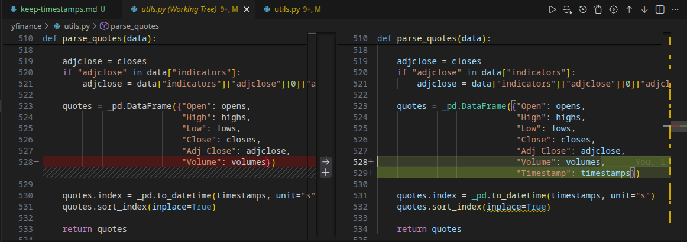

Branch  [keep-timestamps](https://github.com/ofenloch/yfinance/tree/keep-timestamps) will always be in sync with branch [main](https://github.com/ofenloch/yfinance/tree/main).

The only change I plan to make is in file **yfinance/utils.py**:
Function **parse_quotes** will add an extra column to the generated DataFram containing Yahoo's original UNIX timestamp.

